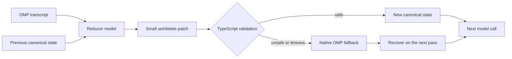

<div align="center">

# StateCompact

### One current state. No stale facts.

Canonical mutable-state compaction for
[Oh My Pi](https://github.com/can1357/oh-my-pi) coding sessions.

[](https://github.com/alesha-pro/omp-statecompact/actions/workflows/ci.yml)    [](LICENSE)

```bash
omp plugin install github:alesha-pro/omp-statecompact
```

</div>

> **Measured result:** 34/34 current values, 0/199 stale values, and a
> 2,683-character state after three compactions. The closest text competitor
> also reached 34/34, but needed 10,211 characters.

## Why this exists

A normal compaction model writes another story about the session:

```text
The app started on port 3000, moved to 8000, and later returned to 3000.
The release branch was replaced by main...
```

That sounds correct, but the next agent call still sees every old value. It has
to decide which one is current again.

StateCompact keeps one answer instead:

```text
runtime.port = 3000
git.branch = main
tests.status = passing
```

When a value changes, the new value replaces the old one. Completed tasks,
resolved blockers, revoked policies, and A -> B -> A reverts are handled as
state transitions rather than extra prose.

| Normal prose compaction | StateCompact |
|---|---|
| Retells what happened | Stores what is true now |
| Can preserve old and new values together | Keeps one canonical value |
| Trusts free-form model output | Validates a bounded `set`/`delete` patch |
| A bad summary becomes the new context | Unsafe output falls back to native OMP |

## How it works



1. OMP chooses the transcript region to compact.
2. The reducer returns a small state patch, not a complete rewritten summary.
3. TypeScript checks schema, size, conflicts, deletion evidence, and collapse
   risk before anything is accepted.
4. The validated patch updates canonical state inside OMP `preserveData`.
5. Real OMP file operations are merged deterministically.

StateCompact never replaces OMP's session manager. If the reducer is slow,
unavailable, or unsafe, native compaction still runs and the last valid state
remains available for recovery.

## Results at a glance

In the six-way semantic-continuation matrix re-measured on the 0.4.0
release commit (three evolving projects, two compactions each, Qwen and
DeepSeek session models), StateCompact and native OMP both recovered 48/48
critical fields; probe recall was 75/78 vs 77/78 in native's favour, while
StateCompact compacted 3-30x faster (2.2-7.8 s vs 16.4-117.1 s per hook)
and ran every second-checkpoint hook through the extension within the host
limit.

Matched Qwen3.6-35B-A3B session, 120 turns, 34 mutable values, three
compactions. StateCompact used Qwen3.7 Flash as reducer.

| Arm | Current | Stale | Visible context | Final recall |
|---|---:|---:|---:|---:|
| **StateCompact 0.3.0** | **34/34** | **0/199** | **2,683 chars** | **34/34** |
| CC Compact 0.1.0 | 34/34 | 0/199 | 10,211 chars | 34/34 |
| Native OMP | 0/34 | current state dropped | 4,974 chars | 0/34 |
| Slipstream 0.1.7 | 0/34 at C1 | 11/68 at C1 | 9,512 chars | not promoted |

The endurance test ran 160 turns and ten consecutive compactions. On the
0.4.0 release commit StateCompact kept 10/10 current values and zero stale
values at every checkpoint, advanced revisions 1-10 with no fallback
(median compaction 5.2 s), and answered the final downstream probe 10/10.

[Read the complete methodology, competitor tournament, failure cases, and
claim boundaries](BENCHMARKS.md).

## Quick start

Install the plugin:

```bash
omp plugin install github:alesha-pro/omp-statecompact
```

Restart OMP and confirm that it loaded:

```bash
omp plugin doctor
```

StateCompact uses the current OMP session model by default. No configuration is
required to try it.

### Recommended OpenRouter reducer

For a smaller and cheaper reducer, create `.omp/statecompact.json` in your
project:

```json
{
  "model": "openrouter/qwen/qwen3.7-flash",
  "timeoutMs": 25000
}
```

OMP supplies the provider credential from its own model registry. StateCompact
does not require a separate API key.

## Commands

| Command | What it does |
|---|---|
| `/statecompact` | Forces a StateCompact compaction |
| `/state` | Shows the latest canonical state |
| `/statecompact-debug` | Shows revisions, tombstones, retries, usage, and timing |

## Configuration

```json
{
  "model": "current",
  "maxOutputTokens": 4096,
  "timeoutMs": 25000,
  "disableReasoning": true,
  "maxInputFraction": 0.92,
  "maxOperations": 256,
  "maxValueChars": 12000,
  "tombstoneLimit": 128,
  "fileHistoryLimit": 200,
  "notify": true
}
```

Model selection order:

1. `--statecompact-model`
2. `STATECOMPACT_MODEL`
3. `.omp/statecompact.json`
4. current OMP model

The default 25-second reducer deadline stays below OMP 17.2.11's fixed
30-second extension-handler limit.

## Safety and privacy

Reducer output is treated as untrusted data. StateCompact rejects malformed,
oversized, contradictory, unsupported, or suspiciously destructive patches
before they can replace context.

The selected transcript is sent to the configured reducer model. Common API
keys, bearer tokens, private keys, access keys, password assignments, and
credentialed URLs are redacted first. Regex redaction cannot cover every secret
format, so do not choose a reducer provider that must not receive the session.

StateCompact stores its state inside the OMP session. It does not create a
separate database or log raw transcripts and reducer responses.

## Development

```bash
git clone https://github.com/alesha-pro/omp-statecompact.git
cd omp-statecompact
bun install
bun run release:check
```

The release gate runs TypeScript checks, 69 deterministic tests, package
inspection, a production dependency audit, isolated installation, and a real
OMP extension-load check.

## License

[MIT](LICENSE)
